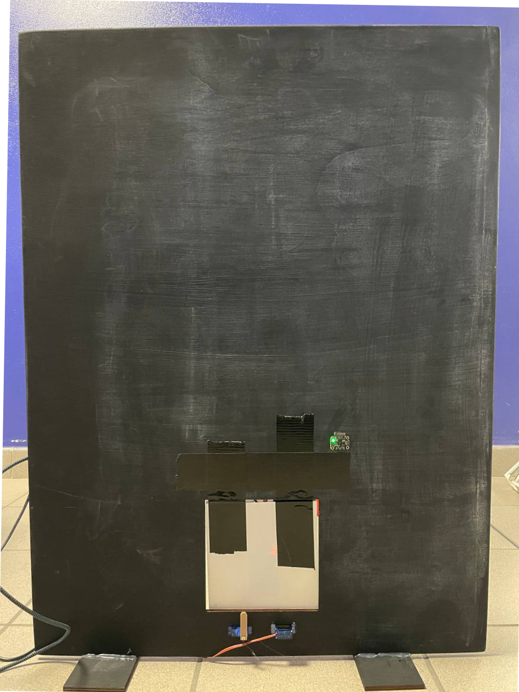

<div align="center">
  <h1>Smart pet door 🐾</h1>
</div>

<div align=center>
  
  <p align=left> 
    This is a smart door that allows a pet to go in and out of the house without owner intervention. The latter will always know the status of his friend thanks to notifications delivered directly to his smartphone.
    The weather conditions and outside temperature are always checked before letting the pet out to ensure its comfort. 
  </p>
</div>

## Video
[](https://www.youtube.com/embed/SmFSCTbaPJA)\
[Presentation](https://docs.google.com/presentation/d/1cns5Rj6kbINs13zt8QyAXymT49cW8snj6NpNNDN8Nfs/edit?usp=sharing)

## Requirements
#### Hardware
Due to limited memory, we had to split the functionality of the system between 2 microcontrollers. This project works on any combination of CircuitPython supported boards of which at least one has built-in wifi.

- Microcontroller 1 (Raspberry Pi Pico): Holds reads sensors and keeps the logic via a state machine. Sensors attached:
    - SHT40 temperature sensor (I2C)
    - RC522 RFID reader (SPI)
    - 2 Servo motors via a 3.3V - 5V level shifter
    - Force sensor
    - Addressable LED strip (WS2812B)

- Microcontroller 2 (Raspberry Pico W): Retrieves the time (NTP) and weather data ([OpenWeather](https://openweathermap.org)) from Internet and sends notifications through [ntfy.sh](https://ntfy.sh).

Both microcontrollers communicate via UART at 115200 baud.

#### Software
Both microcontrollers run CircuitPython version 8.2.8, the latest version at the time of writing. See [getting started](#getting-started) for flashing instructions.

## Project Layout
Wifi enabled board (Raspberry Pico W)
```
├── code.py                         # Main code file
├── lib                             # Libraries folder
│   ├── adafruit_datetime.mpy       #     date and time objects
│   ├── adafruit_logging.mpy        #     logging
│   ├── adafruit_ntp.mpy            #     ntp time
│   └── adafruit_requests.mpy       #     HTTP requests
│
└── settings.toml                   # Holds secrets like WiFi password and API keys
```
Non wifi enabled board (Raspberry Pico)
```
├── code.py                         # Main code file
├── lib                             # Libraries folder
│   ├── adafruit_datetime.mpy       #     date and time objects
│   ├── adafruit_logging.mpy        #     logging
│   ├── adafruit_sht4x.mpy          #     temperature sensor
│   ├── adafruit_ticks.mpy          #     dependency of adafruit_motor
│   ├── mfrc522.mpy                 #     RFID reader (https://github.com/domdfcoding/circuitpython-mfrc522)
│   ├── neopixel.mpy                #     addressable LEDs
│   └── adafruit_motor              #     servo motors
│       ├── __init__.mpy
│       ├── motor.mpy
│       ├── servo.mpy
│       └── stepper.mpy
│
└── src                             # Source code files
    ├── __init__.py                 
    ├── hardware.py                 #     holds hardware references
    ├── state_machine.py            #     implements the state machine
    └── states                      #     states folder
        ├── state.py                #         base state class      
        ├── free_in_out_state.py         
        ├── must_stay_in_state.py
        ├── must_stay_out_state.py
        └── eating_state.py
```

## Getting started
1. Follow [these instructions](https://learn.adafruit.com/welcome-to-circuitpython/installing-circuitpython) to flash CircuitPython onto your boards.

> [!WARNING]  
> Pay attention to download the correct UF2 file for your specific board(s).

> [!TIP]  
> If both microcontrollers are connected to a computer together, sometimes one of the virtual USB drives will be called `CIRCUITPY1` instead of the usual `CIRCUITPY`. We suggest renaming the drives to names like `WIFI` and `NOWIFI` to avoid confusion.

> [!NOTE]  
> This repo targets CircuitPython 8.2.8, the latest version at the time of writing. If the downloaded version is more recent, make sure to replace the libraries with the ones from [adafruit's bundle](https://circuitpython.org/libraries).

2. Empty both virtual USB drives and copy the files from this repo. The ones from the `WIFI/` folder go in the wifi-enabled board, the `NOWIFI/` in the non-wifi-enabled board.

3. On the wifi-enabled board create a `settings.toml` file on the root with the following contents:
    ```
    WIFI_SSID = "<your SSID here>"
    WIFI_PASSWORD = "<your password here>"

    LATITUDE = "<your latitude>"
    LONGITUDE = "<your longitude>"
    OWM_API_KEY = "<your openweathermap api key>"

    NTFYSH_URL = "https://ntfy.sh/<anything you want>"
    ```
> [!NOTE]  
> See [OpenWeather's website](https://home.openweathermap.org/api_keys) to create your API key.

> [!NOTE]  
> The [ntfy.sh](https://ntfy.sh) url can be anything you like. Be creative as it must be unique for all users of the service.

4. Follow [this link](https://docs.ntfy.sh/#step-1-get-the-app) to setup the [ntfy.sh](https://ntfy.sh) app. Make sure to set it up with the same URL chose in step 3.

## Software Architecture
The system's logic is based around a state machine which controls the actions that can be performed during different time slots. 

### State machine
There are 4 possible states: 
- **Must stay out**: from after breakfast (9:30) to lunch (13:00) and from after lunch (13:30) to sunset. 
- **Must stay in**: from dinner (20:00) to sunrise
- **Free in/out**: from after sunrise to breakfast (9:00) and from after sunset to dinner (20:00).
- **Eating**: during breakfast (9:00 - 9:30), lunch (13:00 - 13:30), and dinner (20:30).

Additionally, each day between 00:00 and 00:10 the system retrieves new  weather data, sunrise time, and sunset time from [OpenWeather](https://openweathermap.org).

### Possible actions
The states defined above control what the pet can or can't do during the day: 
- **Must Stay Out**: the pet needs to be outside. It is possible for it to go out (e.g. if it was still inside after meal time) but it won't be able to come back in. 
- **Must Stay In**: the pet is allowed to go inside but it won't be allowed to go out again.
- **Free in/out**: the pet is free to go in and out of the house as it pleases.
- **Eating**:  the pet is still able to come and go as it pleases. The owner will be notified if the pet has not come inside during the meal time (i.e. has not eaten) or it has not come out after the meal time (i.e. not obeying to the "must stay out after the meal" rule). 

### Rule enforcement 
The pet's freedom to go out is limited not only by the time slot but also by:
- Correct RFID badge scanned
- Good atmospherical conditions (good weather and temperature between 5 °C and 32 °C)

Every time the pet wishes to go out, it needs to bring the RFID tag on its collar near the RFID reader. In case the ID is recognized, the outside conditions are evaluated. If the result is positive and the state allows for it, the door will unlock.
In case the ID is not recognized, the owner will receive a notification.

For coming back inside, the RFID tag ID is checked as well as the current time.

### Lock/Unlock the door
The 2 servo motors control the door (un)locking, one for the entrance and the other for the exit. They are on the locked position by default and they will open accordingly to the above-mentioned conditions. Once unlocked, they will return to the locked position after 5 seconds to let the pet traverse the door.

### Force sensor
The pet status (inside/outside) is always known, even in case the door unlocks because it is near the reader. The status is modified only if the pet actually goes through the door. It is achieved via a force sensor positioned between the pet door and the main one. Flexing the sensor will notify the system that the door has swung.

### Notification 
Notifications will be set to the pet owner in a few edge cases such as:
- An unidentified badge read by the RFID reader
- The pet has not come inside during the meal time
- The pet has not gone out after the meal time has ended
- It's dark outside, but the pet has not come in


## Team Members
The project is original work by Carlotta Cazzolli, Alessandro Iepure, and Martina Panini. All the parts of the project were discussed and agreed on by all members. All testing was done directly on the actual hardware.

### Tasks division
Each member had input on each phase of the project. What follows are the main focuses of each person:

**Carlotta Cazzolli**:
- State machine logic and implementation
- Final debugging
- This README file
- Video making

**Alessandro Iepure**: 
- Hardware choice and setup
- Internet requests (weather, time, and notifications)
- Serial communication between microcontrollers
- Video making

**Martina Panini**:
- Hardware choice and setup
- Sensor implementations
- 3D printer designs 
- Presentation

## License
This project is available under the MIT license. See [LICENSE](./LICENSE) for more info.
